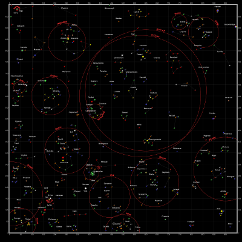
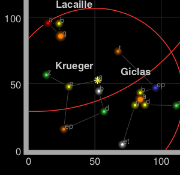

## Not of this earth

有时，地图并不代表地球表面的事物，因此，没有地理纬度和地理经度的概念。大多数时候，这指的是大的扫描图像，例如游戏地图。

在本教程中，我们从 Star Control II 中挑选了一张星图，这款游戏现在可以作为[开源项目 The Ur-Quan Masters](https://en.wikipedia.org/wiki/Star_Control_II#The_Ur-Quan_Masters) 使用。这些地图是用该游戏的[读取开源数据文件的工具](http://www.highprogrammer.com/alan/games/video/uqm/index.html)制作的（网页似乎已经下架，请看[存档版本](https://web.archive.org/web/20171112052528/https://www.highprogrammer.com/alan/games/video/uqm/index.html)），看起来像这样：

 

从角落里可以看到，游戏有一个内置的方形坐标系统，这将使我们能够建立一个坐标系。

 

## CRS.Simple

**CRS** 代表[坐标参考系统](https://en.wikipedia.org/wiki/Spatial_reference_system)，这是地理学家用来解释坐标向量中的坐标含义的术语。例如，如果使用地球上的经纬度，`[15, 60]`代表印度洋上的一个点，在我们的星图中也可以代表太阳系的 Krueger-Z。

Leaflet 地图有一个 CRS（只有一个 CRS ），可以在创建地图时更改。对于我们的游戏地图，我们将使用 `CRS.Simple` 来代表一个正方形网格：

	var map = L.map('map', {
		crs: L.CRS.Simple
	});

然后我们可以添加 `L.ImageOverlay` 星图图像及其 `approximate` 边界：

	var bounds = [[0,0], [1000,1000]];
	var image = L.imageOverlay('uqm_map_full.png', bounds).addTo(map);

然后显示整个地图:

	map.fitBounds(bounds);



这个例子并不完全有效，因为在执行完 `fitBounds()` 后，我们无法看到整个地图。

## CRS.Simple 地图中的常见问题

在默认的 Leaflet CRS 中 `CRS.Earth`，360 度经度映射到 256 个水平像素（缩放级别 0），大约 170 度纬度映射到 256 个垂直像素（缩放级别 0）。

在一个 `CRS.Simple` 中，一个水平地图单元被映射到一个水平像素，以及同上垂直。这意味着整个地图大约有 1000x1000 像素大，无法放入我们的 HTML 容器中。幸运的是，我们可以设置 `minZoom` 为低于零的值：

	var map = L.map('map', {
		crs: L.CRS.Simple,
		minZoom: -5
	});

### Pixels vs. map units

使用时的一个常见错误是在 `CRS.Simple` 中会假设 map unit 等于 pixel。在本例中，地图覆盖 1000x1000 个单位，但图像大小为 2315x2315 像素。不同的情况会要求一个 pixel 等于 一个 map unit，或者 64 个 pixel 等于 一个 map unit，或者其它。考虑网格中的 map unit，然后相应地添加图层（`L.ImageOverlays`、`L.Markers` 等）。

事实上，我们使用的图像覆盖了 1000 多个 map unit - 有相当大的余量。测量 0 和 1000 坐标之间有多少像素，并进行外推，我们可以为该图像获得正确的坐标范围：

	var bounds = [[-26.5,-25], [1021.5,1023]];
	var image = L.imageOverlay('uqm_map_full.png', bounds).addTo(map);

在此期间，让我们添加一些标记：

	var sol = L.latLng([ 145, 175.2 ]);
	L.marker(sol).addTo(map);
	map.setView( [70, 120], 1);



### 这不是你要找的 `LatLng`

你会注意到 Sol 的坐标是 `[145,175]` 而不是 `[175,145]`，地图中心的情况也一样。`CRS.Simple` 中的坐标采用 `[y, x]` 的形式，而不是 `[x, y]`，就像 Leaflet 使用 `[lat, lng]` 而不是 `[lng, lat]` 一样。

<small>(在技术上，Leaflet 更倾向于使用 [`[northing, easting]`](https://en.wikipedia.org/wiki/Easting_and_northing) 而不是 `[easting, northing]`--坐标对中的第一个坐标指向 "north"，第二个指向 "east")</small>

关于 `[lng, lat]` 或 `[lat, lng]` 或 `[y, x]` 或 `[x, y]` 的辩论[并不新鲜，也没有明确的共识](http://www.macwright.org/lonlat/)。由于缺乏共识，Leaflet 有一个名为 `L.LatLng` 的类，而不是更容易引起混淆的 `L.Coordinate`。

如果使用 `[y, x]` 命名的坐标 `L.LatLng` 对您来说没有多大意义，您可以轻松地为它们创建包装器：

	var yx = L.latLng;

	var xy = function(x, y) {
		if (L.Util.isArray(x)) {    // When doing xy([x, y]);
			return yx(x[1], x[0]);
		}
		return yx(y, x);  // When doing xy(x, y);
	};

现在我们可以添加一些星星，甚至是一个带有 `[x, y]` 坐标的导航线：

	var sol      = xy(175.2, 145.0);
	var mizar    = xy( 41.6, 130.1);
	var kruegerZ = xy( 13.4,  56.5);
	var deneb    = xy(218.7,   8.3);

	L.marker(     sol).addTo(map).bindPopup(      'Sol');
	L.marker(   mizar).addTo(map).bindPopup(    'Mizar');
	L.marker(kruegerZ).addTo(map).bindPopup('Krueger-Z');
	L.marker(   deneb).addTo(map).bindPopup(    'Deneb');

	var travel = L.polyline([sol, deneb]).addTo(map);

虽然地图看起来几乎相同，但代码更具可读性：


